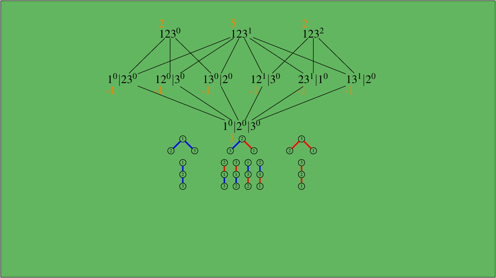

      <!-- Indicators 
      <ol class="carousel-indicators">
        <li data-target="#myCarousel" data-slide-to="0" class="active"></li>
        <li data-target="#myCarousel" data-slide-to="1"></li>
      </ol> -->

      

        

          
          

            

              <h1>MA 714 Poset Cohomology and Combinatorial Species</h1>

  <h3>Fall 2017</h3>
  

   <a class="btn btn-lg btn-primary showinfo" name="MA 714 001" href="/pages/courses/ma714001-201701.pdf" role="button">Course description</a>
   <!-- <a class="btn btn-lg btn-primary showinfo" name="MA/CS 415G 001" href="/pages/courses/homeworkma415G001-201602.html" role="button">Homework</a>
	-->	  
	  

            

          

        

<!--
        

          
          

            

              <h1>MA 114 001-004 Calculus II</h1>
  <h2>Spring 2016</h2>
  

   <a class="btn btn-lg btn-primary showinfo" name="MA 114 001-004" href="http://www.ms.uky.edu/~droyster/ma114F16/	" role="button">Course webpage</a>
   <a class="btn btn-lg btn-primary" name="MA 114 001-004" href="http://webwork.as.uky.edu/webwork2/MA114F16/" role="button">Online homework</a>   
   <a class="btn btn-lg btn-primary showinfo" name="MA 114 001-004" href="/pages/courses/ma114-001-004-201602.html" role="button">Info Sections 001-004</a>

  

            

          

        
-->
        
      

     
 <!--     <a class="left carousel-control" href="#myCarousel" role="button" data-slide="prev">
        
        Previous
      </a>
      <a class="right carousel-control" href="#myCarousel" role="button" data-slide="next">
        
        Next
      </a>-->
 

