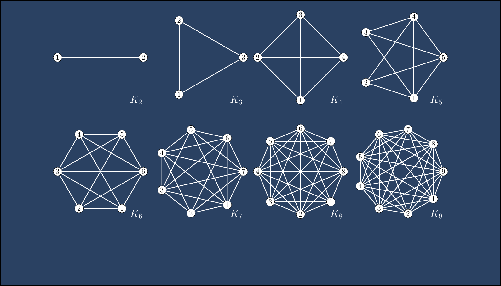

      <!-- Indicators -->
      <ol class="carousel-indicators">
        <li data-target="#myCarousel" data-slide-to="0" class="active"></li>
      </ol>

      

        

          
          

            

              <h1>415G Combinatorics and Graph Theory</h1>
  <h2 class="white">Fall 2015</h2>
  

   <a class="btn btn-lg btn-primary showinfo" name="MA 415G 001" href="/pages/courses/ma415G001-201502.html" role="button">View course page</a>
   <a class="btn btn-lg btn-primary showinfo" name="MA 415G 001" href="/pages/courses/homeworkma415G001-201502.html" role="button">Homework</a>   
  

            

          

        

      

 

