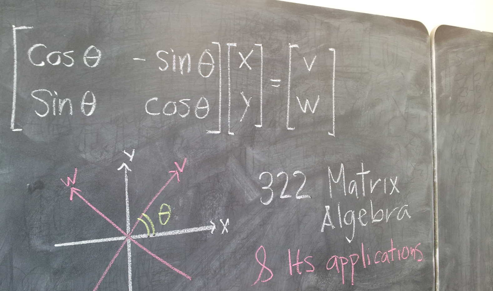

      <!-- Indicators -->
      <ol class="carousel-indicators">
        <li data-target="#myCarousel" data-slide-to="0" class="active"></li>
        <li data-target="#myCarousel" data-slide-to="1"></li>
      </ol>

      

        

          
          

            

              <h1>MA 322 003 Matrix Algebra and its Applications</h1>
  <h2>Spring 2016</h2>
  

   <a class="btn btn-lg btn-primary showinfo" name="MA 322 003" href="http://dleon.combinatoria.co/pages/courses/ma322003-201601.html" role="button">Course webpage</a>
   <a class="btn btn-lg btn-primary" name="MA 322 003" href="http://webwork.as.uky.edu/webwork2/MA322003S16" role="button">Homework</a>
   <a class="btn btn-lg btn-primary showinfo" name="MA 322 003" href="/pages/courses/suggestedproblemsma322003-201601.html" role="button">Suggested exercises</a>  
  

            

          

        

        

          
          

            

              <h1>MA 113 011-014 Calculus I</h1>
  <h2>Spring 2016</h2>
  

   <a class="btn btn-lg btn-primary showinfo" name="MA 113 011-014" href="http://www.ms.uky.edu/~ma113/s.16/" role="button">Course webpage</a>
   <a class="btn btn-lg btn-primary" name="MA 113 011-014" href="https://courses1.webwork.maa.org/webwork2/uky-ma113" role="button">Online homework</a>   
   <a class="btn btn-lg btn-primary showinfo" name="MA 113 011-014" href="/pages/courses/ma113-011-014-201601.html" role="button">Info Sections 011-014</a>

  

            

          

        

      

      
      <a class="left carousel-control" href="#myCarousel" role="button" data-slide="prev">
        
        Previous
      </a>
      <a class="right carousel-control" href="#myCarousel" role="button" data-slide="next">
        
        Next
      </a>
 

